# 🚀 Solo‑Dev Kubernetes Platform Starter

A **turn‑key Dev ➜ Prod stack** for web applications that scales from a single‑node k3s on your laptop to Google GKE Autopilot in production—fully reproducible with **Terraform**, **Helm/Helmfile**, and **Argo CD**.

> ✨ Everything is automated. If you can run `git push`, you can ship to prod.

---

## 📁 Repository layout (top‑level)

```
.
├── bootstrap/           # Argo CD root + addon Applications
├── charts/              # Reusable Helm chart(s)
├── clusters/            # Env‑specific Helmfile releases (staging / prod)
├── dev/                 # Tilt + local values for k3s
├── docs/                # Deep‑dive docs & runbooks
├── infra/               # Terraform roots (staging / prod GKE)
├── scripts/             # Helper scripts (bootstrap, deploy, k3d init)
├── .github/workflows/   # CI (build) • CD (deploy) • IaC (infra)
├── Taskfile.yml         # One‑liner commands (`task -l`)
├── devbox.json          # Pure CLI toolchain via Nix
├── .mise.toml           # Language runtimes (Node, Go, Python)
└── README.md            # ← you are here
```

---

## 🖥️  Quick start for contributors

```bash
# 1. Clone & enter reproducible shell (installs CLIs via Nix)
$ devbox shell

# 2. Install language runtimes (Node 20, Go 1.22, Python 3.12)
$ mise install

# 3. Spin up local k3s cluster + live‑reload dev loop
$ task dev:up             # creates k3d cluster & opens Tilt dashboard

# 4. Browse app at http://localhost:8080 (auto reload on save)
```

*To clean up, run `task dev:down`.*

---

## 🏗️  Provision cloud infrastructure

```bash
# Bootstrap Terraform state manually once (see infra/*/backend.tf)
# Then provision staging GKE Autopilot cluster
$ task tf:plan ENV=staging
$ task tf:apply ENV=staging

# (Prod requires PR + approval / GitHub Environment gate)
```

Terraform plans & applies can also be triggered via **GitHub Actions ➜ "Terraform‑Infra"** workflow.

---

## 🔄 CI / CD flow (GitHub Actions ✚ Argo CD)

1. **Push to `main`** → `build.yml` tests, builds, scans, and pushes a multi‑arch container image.
2. `deploy.yml` opens an **auto‑PR** that bumps the image tag in `clusters/staging` values.
3. Merge the PR → Argo CD syncs staging.
4. Validate staging → promote to prod via a protected PR (`task deploy:prod` or merge the prod PR).

```mermaid
graph TD
  A[Commit → main] --> B(CI Build & Scan)
  B --> C(Image registry: GHCR)
  B --> D(PR: bump staging tag)
  D -->|merge| E(Argo CD sync staging)
  E --> F(Verify)
  F --> G[PR: bump prod tag]
  G -->|merge| H(Argo CD sync prod)
```

<details>
<summary>Mermaid diagram</summary>



</details>

---

## ⚙️  Common Taskfile commands

| Command                        | What it does                                          |
| ------------------------------ | ----------------------------------------------------- |
| `task k3s:init`                | Create local k3d cluster (`k3s-dev`)                  |
| `task dev:up` / `dev:down`     | Start/stop Tilt live reload                           |
| `task build:image`             | Build & push multi‑arch image (uses Buildx)           |
| `task scan:trivy`              | CVE scan the image                                    |
| `task deploy:staging`          | Deploy current `IMAGE_TAG` to staging via Helmfile    |
| `task rollback:prod TAG=<sha>` | Roll back production to previous image                |
| `task bootstrap:cluster`       | Install Argo CD & app‑of‑apps on current kube‑context |

> Run **`task -l`** to list *all* tasks.

---

## 🛠️  Adding a new micro‑service

1. Duplicate `values-examples/nodejs.yaml` (or Django/Golang…) into `clusters/staging/values/`.
2. Add a release entry in `clusters/staging/helmfile.yaml` → point to `charts/webapp-template`.
3. Commit & push — CI will bump image tag automatically.
4. Promote to prod via the same GitOps PR flow.

---

## 🆘  Troubleshooting

| Problem                    | Where to look                                                   |
| -------------------------- | --------------------------------------------------------------- |
| **Pods CrashLoop**         | `kubectl logs`, check ExternalSecrets values (Infisical)        |
| **Ingress 404**            | `kubectl describe ingress <name>` or Traefik dashboard          |
| **HPA not scaling in dev** | Autoscaling disabled in `dev/values-local.yaml`                 |
| **Terraform failure**      | GitHub Actions ➜ Terraform‑Infra logs / or local `task tf:plan` |

Detailed runbooks live under **`docs/runbooks/`**.


---
## For Self Hosting Open Source Software 

### Short answer

**The stack is already well-suited for self-hosting open-source applications** (think Nextcloud, Gitea, Plausible, Mastodon, etc.). Nothing fundamental must change; you mainly decide ***how*** you bring each app in:

1. **Use their official Helm chart**
   *Most OSS projects expose one.*

   * Add a new `bootstrap/argocd/applications/<app>.yaml` that points to the public chart repo and version you want.
   * Keep it in the same *addons* AppProject, or create a separate AppProject if you want tighter RBAC.

2. **Wrap the upstream container in your `webapp-template` chart**
   *Great when the project ships only raw images or docker-compose.*

   * Drop the image/tag into `clusters/*/values/<app>-values.yaml`.
   * Use your own `Ingress`, `HPA`, `ExternalSecret` blocks instead of whatever their compose file suggests.

3. **Fork & harden**

   * Build the image yourself via the **`build.yml`** pipeline (so Trivy & Cosign sign/scan it).
   * Swap to `REGISTRY=ghcr.io/<you>` in the app values.

---

### What to keep in mind

| Area                     | Tips for self-hosting OSS apps                                                                                                                                |
| ------------------------ | ------------------------------------------------------------------------------------------------------------------------------------------------------------- |
| **Licensing**            | Some AGPL apps require that you publish *your* source if you modify them. Keep a LICENSE or NOTICE file in the repo when needed.                              |
| **Container provenance** | Prefer building your own image in CI → you get SBOM and Cosign signature automatically.                                                                       |
| **Secrets**              | Many community charts still use plain `values.yaml` for passwords. Route those through **Infisical** + `ExternalSecret` so they stay out of Git.              |
| **Storage**              | A lot of self-hosted tools need PVCs (Nextcloud, databases). GKE Autopilot supports RWX Filestore CSI; add a `storageClassName` override in the app’s values. |
| **Ingress**              | Your Traefik chart already handles Let’s Encrypt. Map each app’s sub-domain in its values file (staging & prod).                                              |
| **Resource limits**      | Open-source images often have none. Set reasonable requests/limits in their per-env values to avoid OOMs.                                                     |
| **Back-ups**             | Velero is in your addons list—make sure to add each PersistentVolumeClaim to the Velero schedule (label selector).                                            |
| **Upgrade cadence**      | Pin explicit chart/image versions in every `Application`; renovate-bot or Dependabot can later bump them via PRs.                                             |

---

### Example: adding Gitea (lightweight Git server)

1. **Add repo to allowed list**

```yaml
# bootstrap/argocd/projects/default.yaml
spec:
  sourceRepos:
    - https://dl.gitea.io/charts/
```

2. **Create the Argo CD Application**

```yaml
# bootstrap/argocd/applications/gitea.yaml
apiVersion: argoproj.io/v1alpha1
kind: Application
metadata:
  name: gitea
  namespace: argocd
spec:
  project: default
  destination:
    server: https://kubernetes.default.svc
    namespace: gitea
  source:
    repoURL: https://dl.gitea.io/charts/
    chart: gitea
    targetRevision: 10.2.3
    helm:
      values: |
        ingress:
          enabled: true
          hosts:
            - host: git.example.com
              paths: ["/"]
        postgresql:
          enabled: false              # use CloudSQL or AlloyDB
  syncPolicy:
    automated:
      prune: true
      selfHeal: true
    syncOptions: [CreateNamespace=true]
```

3. **Commit → Argo CD syncs**.
   The app rides on the same observability, TLS, autoscaling, and backup tooling you already have.

---

### Bottom-line

*Your platform already covers the heavy lifting — CI scanning, GitOps deployment, TLS, secrets, backups, autoscaling.*
Self-hosting an open-source project is now just:

```bash
# 1. Add or wrap a Helm chart
git add bootstrap/argocd/applications/<app>.yaml
git commit -m "feat: self-host <app>"
git push
# 2. Watch Argo CD turn it green 🚦
```

If you run into a specific OSS app that doesn’t “just drop in,” let us know and we can adapt the template.

---

## 🙋 FAQ

* **Why GKE Autopilot?** Zero node management; Google handles upgrades & security patches.
* **Why k3d instead of minikube?** Faster, Docker‑native, matches k3s used in edge devices.
* **Why Devbox *and* Mise?** Devbox gives an instant Nix shell of CLI tools; Mise pins language runtimes IDEs rely on.
* **Can I use AWS/EKS instead?** Yes—swap the Terraform modules for `terraform-aws-modules` equivalents and tweak the clusters/ configs.

---

## 🤝 Contributing

PRs are welcome! Please run local `task lint:yaml` and `task lint:helm` before opening a pull request, and ensure `build.yml` passes.

---

## License

MIT. See `LICENSE` file for details.

<div align="center">
  <sub>Happy shipping! 🚢</sub>
</div>
