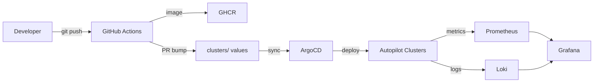

# 🌐 Kubernetes Platform – Architecture Overview

This document walks through the *why* and *how* of our Dev → Prod platform.

## High‑level diagram

## Key components & rationale
| Layer | Tool | Why |
|-------|------|-----|
| Container Runtime | **GKE Autopilot** | Zero node ops; Google runs the control plane & nodes |
| GitOps Engine | **Argo CD** | Declarative, auditable, self‑heal |
| Ingress | **Traefik 3** | Modern, CRD‑based, integrates Let’s Encrypt |
| Service Mesh | **Linkerd 2.18** | Ultra‑light Rust sidecars + MTLS |
| Observability | **Grafana Alloy → Loki/Prometheus** | Single‑binary agent, easy SRE hand‑off |
| Policy | **OPA Gatekeeper** | Kubernetes‑native admission control |

## Dev workflow summary
1. `tilt up` on k3s for live coding.
2. Push to `main` → CI builds & scans image.
3. CI bumps the image tag in staging → PR → merge.
4. Argo CD syncs staging; verify.
5. Promote same tag to prod via protected PR.